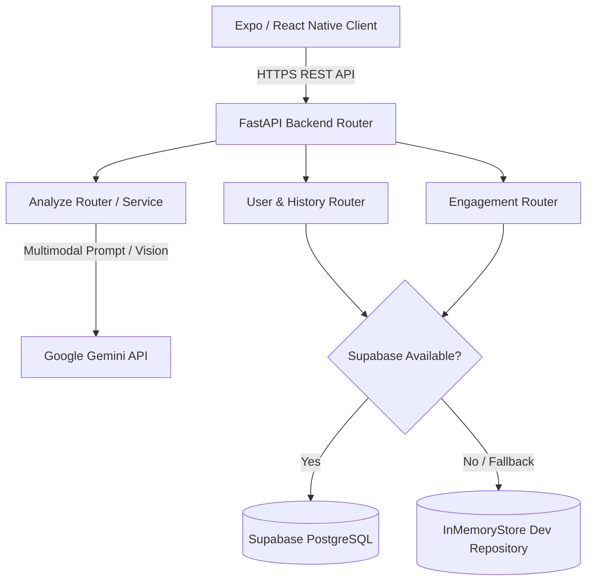

# NutriLens - System Architecture & Technical Specifications

## 1. System Overview

NutriLens is designed around a modern decoupled client-server architecture. The frontend mobile app built with **React Native / Expo** communicates via HTTP REST APIs with a lightweight, high-performance **FastAPI (Python)** backend. The backend coordinates AI processing via **Google Gemini (LLM & Vision)** and persistence via **Supabase (PostgreSQL)** with an automated fallback to an **In-Memory Store**.



---

## 2. Technology Stack

### 2.1 Mobile Frontend Application
- **Framework**: React Native with Expo (v57+ framework & SDK).
- **Navigation & Routing**: `expo-router` (File-based routing system).
- **Styling Engine**: `nativewind` (Tailwind CSS utility wrapper for React Native) + `global.css`.
- **Language**: TypeScript (Strict type checking).
- **Icons & UI Utilities**: Lucide Icons / Expo Vector Icons.

### 2.2 Backend Application & API
- **Framework**: FastAPI (Python 3.11+).
- **Server Gateway**: Uvicorn ASGI Server.
- **Data Validation & Schemas**: Pydantic v2.
- **Cross-Origin Resource Sharing**: `fastapi.middleware.cors.CORSMiddleware`.

### 2.3 AI & Intelligence Layer
- **LLM Provider**: Google Generative AI (`google-generativeai` SDK).
- **Primary Model**: `gemini-1.5-flash` / `gemini-2.0-flash`.
- **Capability**: Dual input support (multimodal base64 image scanning + raw text OCR string parsing).
- **Output Enforcement**: JSON response schema prompt formatting with automatic backtick cleanups.

### 2.4 Persistence & Database Layer
- **Primary Cloud DB**: Supabase (PostgreSQL Database).
- **Fallback Store**: `InMemoryStore` singleton pattern for offline testing and dev zero-config fallback.

---

## 3. Data Schema & Models

### 3.1 User Profile Model
```json
{
  "user_id": "string (UUID / default_user)",
  "dietary_preferences": ["string"],
  "allergies": ["string"],
  "health_goals": ["string"]
}
```

### 3.2 Scan History Model
```json
{
  "id": "string (scan-uuid)",
  "product_name": "string",
  "scanned_at": "ISO-8601 Timestamp",
  "health_score": "number (0-100)",
  "allergen_flags": ["string"],
  "verdict_summary": "string",
  "ocr_text": "string"
}
```

### 3.3 User Stats & Engagement Model
```json
{
  "user_id": "string",
  "current_streak": "number",
  "scans_today": "number",
  "total_scans": "number",
  "xp": "number",
  "level": "number",
  "last_active_date": "YYYY-MM-DD"
}
```

---

## 4. API Endpoints Specification

### 4.1 Analysis Routers (`/api/analyze`)
- `POST /api/analyze`
  - **Body**: `{ "ocr_text": "string", "image_base64": "string" (optional) }`
  - **Response**: `{ "status": "success", "data": { "health_score": 85, "verdict_summary": "...", "ingredients": [...], "allergen_warnings": [...] } }`

### 4.2 User Profile Routers (`/api/user`)
- `GET /api/user/profile` — Fetch active dietary profile & health goals.
- `POST /api/user/profile` — Update user dietary preferences & allergies.
- `GET /api/user/stats` — Fetch XP, level, daily scan count, and streak status.

### 4.3 Scan History Routers (`/api/history`)
- `GET /api/history` — List chronological scan history records.
- `GET /api/history/{scan_id}` — Retrieve detailed record for a specific scan.

### 4.4 Engagement & Quiz Routers (`/api/engagement`)
- `GET /api/engagement/quizzes` — Fetch available daily health quizzes.
- `POST /api/engagement/quizzes/submit` — Submit quiz answer and claim XP rewards.
- `GET /api/engagement/badges` — Fetch unlocked and locked user badges.

---

## 5. Security & Infrastructure Guidelines
- **API Environment Isolation**: Environment keys stored securely in `backend/.env`.
- **CORS Management**: Configured in `main.py` allowing origins dynamically.
- **Graceful Error Handling**: Fallback mechanisms prevent backend crashes during database downtime or LLM API quota exhaustion.
