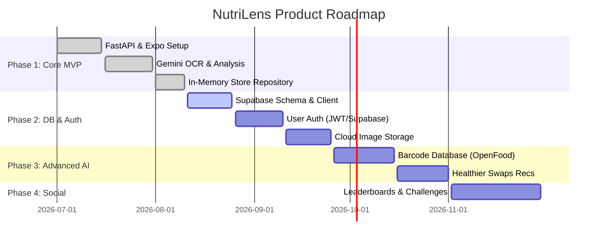

# NutriLens - Development Phases & Product Roadmap

## 1. Roadmap Overview

The development of NutriLens is structured into four strategic phases, progressing from the initial core MVP scanner to advanced AI barcode lookup and social gamification.

---

## 2. Detailed Phase Breakdowns

### Phase 1: Foundation & Core Scanner MVP (Status: Completed ✅)
- **Objectives**: Build core client-server architecture, multimodal label scanner, and gamification screens.
- **Deliverables**:
  - [x] FastAPI backend setup with Modular Routers (`/analyze`, `/user`, `/history`, `/engagement`).
  - [x] Google Gemini LLM Service integration for ingredient safety scoring and allergen extraction.
  - [x] React Native Expo frontend with `expo-router` (`/index`, `/scanner`, `/results`, `/engagement`).
  - [x] `InMemoryStore` fallback repository pattern.

---

### Phase 2: Database Integration & Production Hardening (Status: Active 🚧)
- **Objectives**: Transition from development mock store to production cloud database with user authentication.
- **Deliverables**:
  - [ ] Complete Supabase PostgreSQL table setup (`profiles`, `scan_history`, `user_stats`, `badges`, `quizzes`).
  - [ ] Implement Supabase Auth (Email/Password & Social OAuth).
  - [ ] Raw scan photo uploading to Supabase Storage bucket.
  - [ ] Production API CORS restrict strategy & Rate Limiting middleware.

---

### Phase 3: Advanced AI & Product Recommendations (Status: Planned 📅)
- **Objectives**: Enhance product identification speed via barcode scanning and provide healthier alternative product suggestions.
- **Deliverables**:
  - [ ] Real-time Barcode Camera Reader (EAN/UPC format).
  - [ ] Open Food Facts API integration for instant product lookup without LLM latency.
  - [ ] AI-driven "Healthier Alternative Swap" recommendations for low-scoring foods.
  - [ ] Offline scanning queue & synchronization.

---

### Phase 4: Gamification & Social Community (Status: Future 🚀)
- **Objectives**: Drive viral retention and social engagement through challenges, community scores, and shareable health cards.
- **Deliverables**:
  - [ ] Weekly Community Nutrition Challenges & Leaderboards.
  - [ ] Shareable Social Graphic Cards ("My Scan Summary").
  - [ ] Custom Dietary Groups (e.g., Keto, Vegan, Halal, Kosher verification tags).
